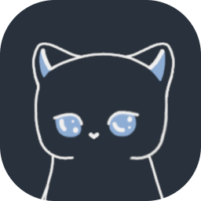

<div align="center">
  
  <h1>PostHub</h1>
</div>

<p align='center'>
  
  
  
  
  
  
  
</p>

# 🚀 Welcome to our platform

This is a new platform for publishing your amazing posts. Here, you'll find a variety of different topics and interests. You can create whatever you like, generate new posts, engage in discussions in the comments, or simply read the latest updates and react to them. A convenient filtering and posting system will help you browse only the content that interests you, while interactions with other participants will keep things exciting.

## 🖼️ Screenshots

<div>
  
  
  
  
  
</div>

## 🛠 Development

Environment setup

You need to get the Supabase and TinyMCE keys and create an env file by defining the following variables:

```bash
VITE_SUPABASE_URL=https://[YOUR_PROJECT_ID].supabase.co
VITE_SUPABASE_ANON_KEY=******
VITE_TINYMCE_KEY=******
```

When developing use:
```bash
yarn dev
```

A development server will automatically open the project in your browser. Normally here: `http://localhost:8080`.


To build the project use:
```bash
yarn build
```

A web ready folder will be created in `/dist/`.